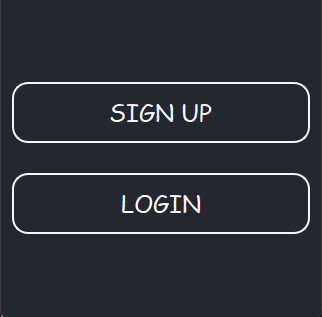
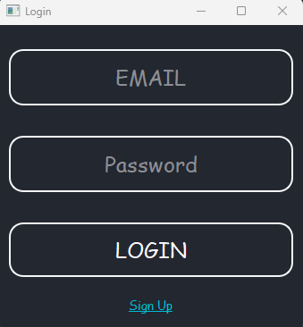

# Birostris Pass - Password Manager

A modern, secure, and user-friendly password manager desktop app built with Python and PyQt5.


## Features
- Master password protection
- Encrypted local storage (SQLite + cryptography)
- Per-user database files for strong data separation
- Add, edit, and delete password entries
- Password generator (minimal and customizable)
- Modern dark theme UI with playful Comic Sans MS font
- Card-based layout with avatars and pill-shaped info
- Copy username/password to clipboard
- All actions accessible via a clean context menu
- "Remember This Email" login feature

## Setup
1. **Clone the repository:**
   ```sh
   git clone https://github.com/agirkayamemin/birostris_pass.git
   cd birostris_pass
   ```
2. **Create a virtual environment (recommended):**
   ```sh
   python -m venv .venv
   # On Windows:
   .venv\Scripts\activate
   # On macOS/Linux:
   source .venv/bin/activate
   ```
3. **Install dependencies:**
   ```sh
   pip install -r requirements.txt
   ```

## Usage
Run the app with:
```sh
python main.py
```
- Add, edit, and manage your passwords securely.

## Notes
- **Your data is stored locally and encrypted.**
- Each user has a separate database file in `data/` (excluded from git).
- The UI is designed to be playful and modern, inspired by popular password managers.
- For any issues or feature requests, open an issue on GitHub.

---

## Screenshots

### Opening Window


### Sign Up Window


### Login Window


### Main Window


**Enjoy your secure and stylish password manager!** 